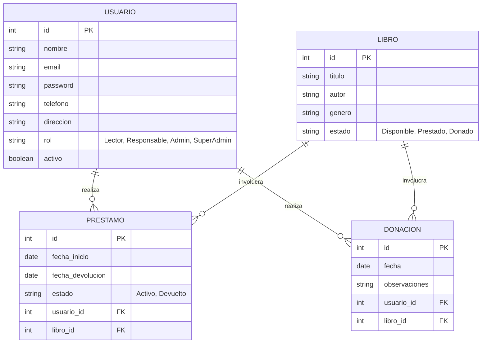
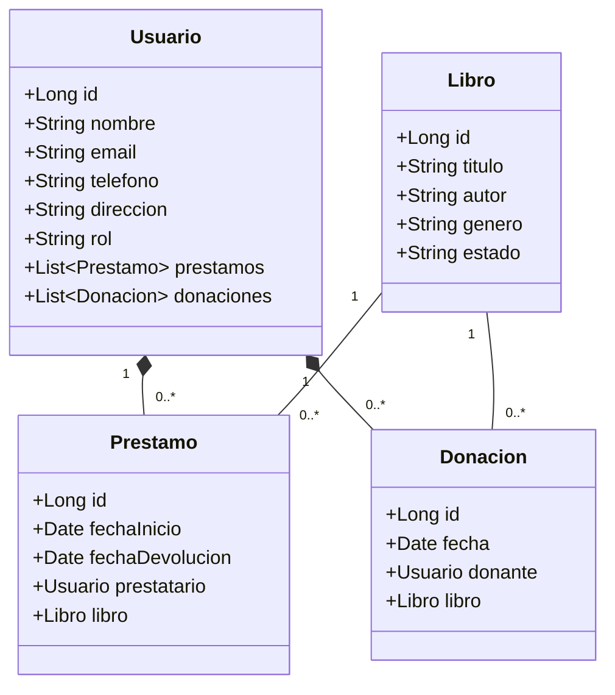
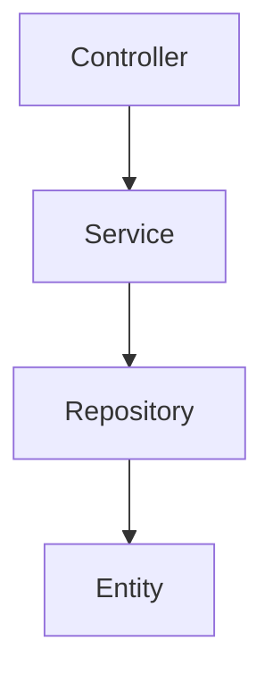

# Documentación Técnica: Diagramas del Proyecto

Este documento contiene los diagramas estructurales para la aplicación de gestión de préstamos y donaciones de libros.

## Diagrama Entidad-Relación (ER)
Este diagrama representa la estructura de la base de datos y cómo se relacionan las entidades principales.

---

## Diagrama de Clases
Este diagrama representa la estructura de clases en el backend (Spring Boot), siguiendo la arquitectura por capas.

---

## Estructura de Capas (Spring Boot)

